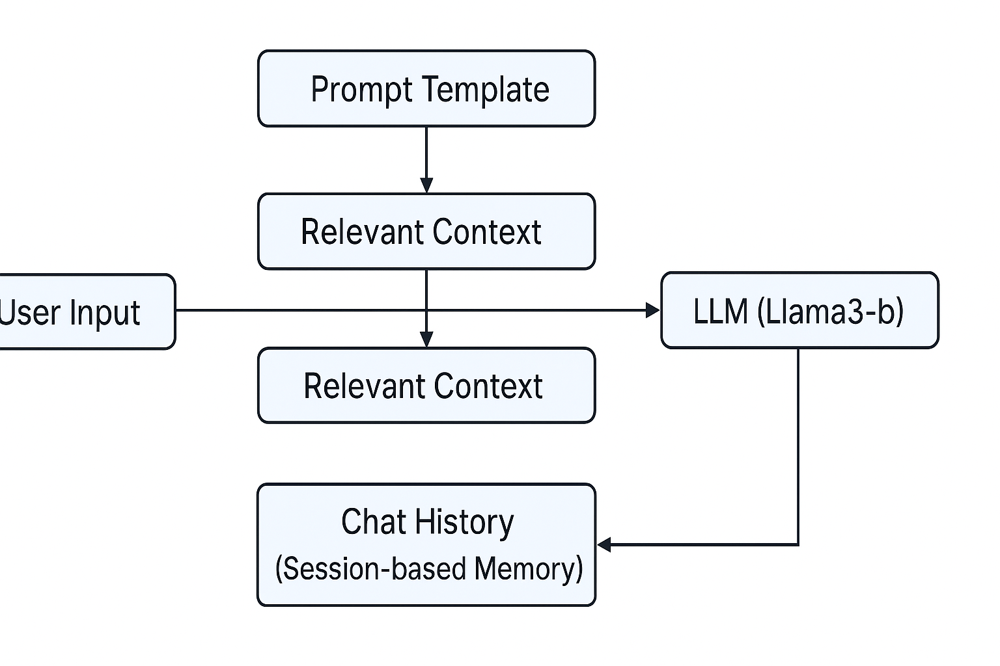

# 🤖 Conversational Q&A RAG Chatbot with Memory using LangChain, HuggingFace and Groq AI

A **modular, memory-enhanced Retrieval-Augmented Generation (RAG) chatbot** built using [LangChain](https://www.langchain.com/), Groq’s blazing-fast LLaMA3 API, Chroma vector store, and HuggingFace sentence embeddings.

This project allows **multi-turn conversations** with context-aware question reformulation and history tracking using session-based memory — making it ideal for educational assistants, AI agents, and document-based Q&A.

---

### 📋 Key LangChain Features Used

| Feature                          | Description                                               |
| -------------------------------- | --------------------------------------------------------- |
| `ChatPromptTemplate`             | Modular prompt templates for structured messaging         |
| `StrOutputParser`                | Clean extraction of string responses from raw LLM outputs |
| `RunnableWithMessageHistory`     | Maintains chat state across multiple LLM calls            |
| `Chroma.from_documents`          | Create vector store from document chunks with embeddings  |
| `as_retriever()`                 | Convert vector store into retriever for use in RAG        |
| `LCEL (operator)`                | Expressive pipeline chaining of LangChain component       |
| `create_history_aware_retriever` | Convert an updated retriever which remembers chat history |

## 📚 What You’ll Learn

- How to build a RAG chatbot with:
  - Custom vector store retrieval
  - Prompt engineering for Q&A
  - Chain and agent-based memory integration
- How to maintain **conversational context** using `RunnableWithMessageHistory`
- How to scrape and chunk real web content for vector-based retrieval

---

## 🧠 Architecture Overview

## 

## 🧠 App Preview

## 

## 🧩 Tech Stack

- 🦜 **LangChain**: Core framework
- 🧠 **Groq LLaMA3**: High-performance LLM
- 🔍 **ChromaDB**: In-memory vector store
- 🧬 **HuggingFace MiniLM Embeddings**
- 🌐 **WebBaseLoader**: Web scraping from blog/article sources
- 🧱 **RecursiveCharacterTextSplitter**: Smart document chunking
- 💬 **Session-based Chat History**: Rehydration of past queries

---

## 📦 Installation

```bash
git clone https://github.com/your-username/Conversational-QnA-Chatbot.git
cd Conversational-QnA-Chatbot
pip install -r requirements.txt
```

---

## 🔐 Environment Variables

Create a `.env` file in the root directory with the following:

```env
GROQ_API_KEY=your_groq_key
HF_TOKEN=your_huggingface_token
```

---

## 🧪 Usage

```python
# Step 1: Run once to initialize & ingest docs
python rag_chatbot.py

# Step 2: Start chatting with conversational memory!
conversational_rag_chain.invoke(
    {"input": "What is Chain of Thought?"},
    config={"configurable": {"session_id": "your-session-id"}}
)
```

---

## 📘 Example Use Case

```python
# First question
conversational_rag_chain.invoke(
    {"input": "What is Chain of Thought?"},
    config={"configurable": {"session_id": "abc456"}}
)

# Follow-up question with context memory
conversational_rag_chain.invoke(
    {"input": "What are common ways of doing it?"},
    config={"configurable": {"session_id": "abc456"}}
)
```

---

## 🛠️ Extending This

Want to plug in your own documents or data sources?

Just change the source URL here:

```python
loader = WebBaseLoader(
    web_paths=("https://your-site.com/article",),
    ...
)
```

Or replace with PDF/Text loader for local files.

---

## 🧠 Memory Types You Can Explore

- `RunnableWithMessageHistory` (current)
- `ConversationBufferMemory`
- `ZepMemory`, `ChromaMemory` (advanced)

---

## 📄 Resources Used

- [Lilian Weng’s Agent Blog](https://lilianweng.github.io/posts/2023-06-23-agent/)
- [LangChain Docs](https://docs.langchain.com/)
- [Groq LLM API](https://console.groq.com/)

---

## 💬 License

MIT License. Feel free to fork, extend, or deploy in your projects.

---
